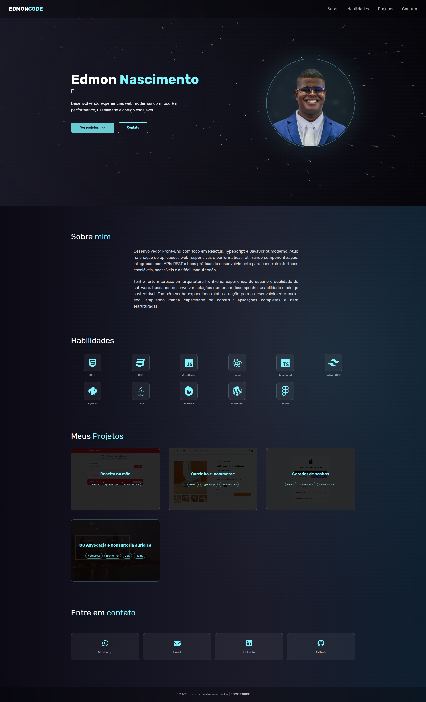
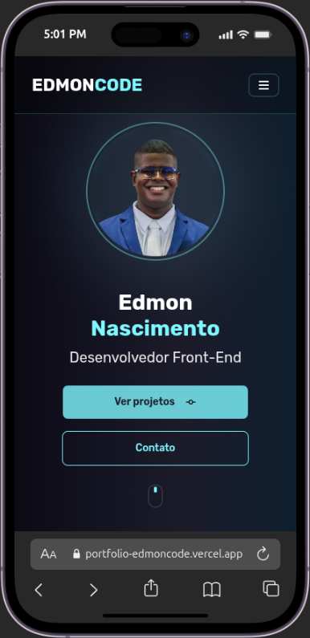

# Edmon Nascimento's Portfolio

**Responsive personal portfolio built with React, TypeScript, and TailwindCSS.**

This project was developed to showcase Edmon Nascimento's projects, skills, and contact information in a professional and interactive manner, with a focus on responsive layouts and user experience.

## Live Demo

🔗 [https://portfolio-edmoncode.vercel.app/](https://portfolio-edmoncode.vercel.app/)

## Preview




## Technologies

- **React:** JavaScript library for building user interfaces.

- **TypeScript:** Superset of JavaScript that adds static typing.

- **Tailwind CSS:** Utility-first CSS framework for rapid and responsive styling.

- **Vite:** Fast build tool for modern web projects.

- **Radix UI:** Library of accessible and customizable UI components.

- **Lucide React:** Icon library.

- **Three.js:** JavaScript library for rendering 3D graphics in the browser.

- **Typed.js:** Library for typing animation effects.

## Features

- Responsive layout for mobile and desktop devices.

- Interactive Hero Section.

- Detailed "About Me" section.

- Display of technical skills.

- Projects gallery with relevant links.

- Contact section with information and a form.

- Intuitive navigation with header and footer.

## How to Run Locally

Clone the project:

```bash
git clone https://github.com/Edmon-Nascimento/portfolio-edmoncode.git
```

Install dependencies:

```bash
cd portfolio-edmoncode
yarn install
```

Start the development server:

```bash
yarn dev
```

The application will be available at `http://localhost:5173` (or another port if 5173 is in use ).

## Author

GitHub:[https://github.com/Edmon-Nascimento](https://github.com/Edmon-Nascimento)

LinkedIn:[https://www.linkedin.com/in/edmon-nascimento/](https://www.linkedin.com/in/edmon-nascimento/)

## License

This project is licensed under the MIT License. See the [LICENSE](LICENSE) file for more details.